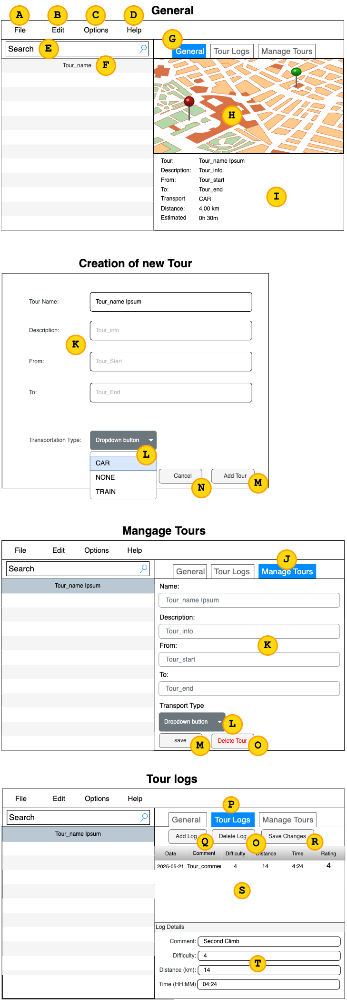
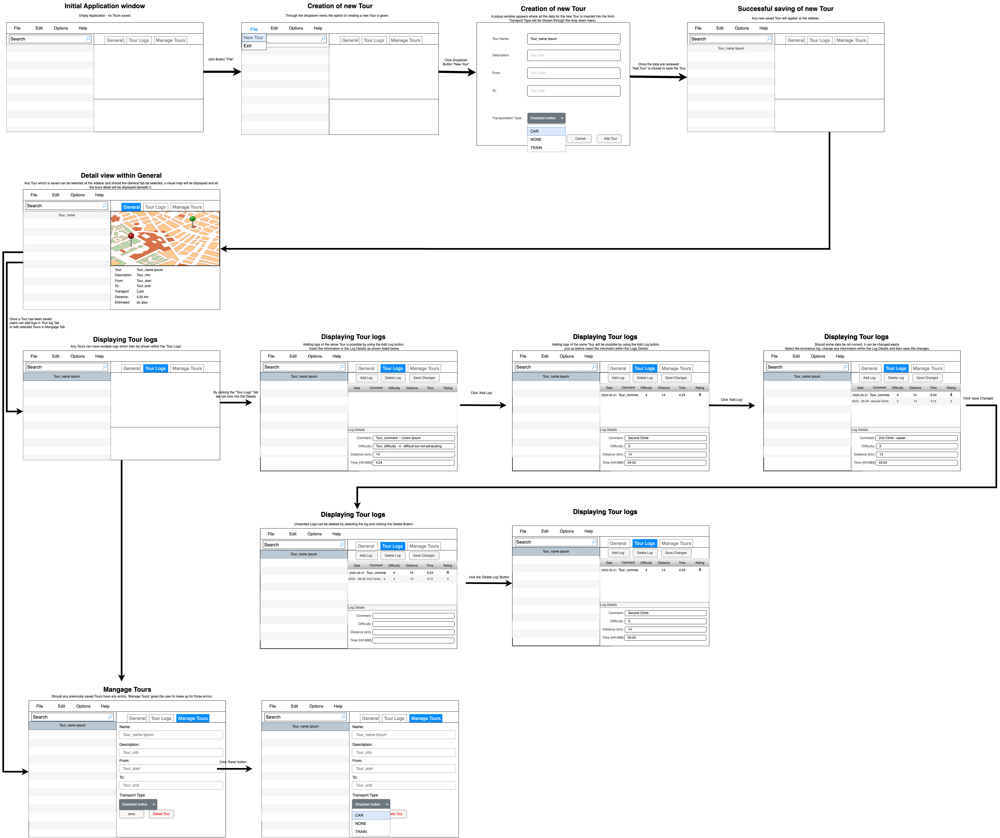

# TourPlanner (Latinovic, Asuncion)

TourPlanner ist eine JavaFX-Anwendung zur Verwalten von Touren.
Die Anwendung folgt dem MVVM-Architekturmuster und ermöglicht es Benutzer:innen, Touren zu erstellen,
zu bearbeiten, zu löschen und mit detaillierten TourLogs zu versehen.

## Requirements
```
Java-Version: 21
JavaFX-web maybe has to be added manually 
    -IntelliJ Maven-Dependencies-(right click javafx-web)-Download sources
```

## UX Documentation

This section describes the User Experience (UX) of the TourPlanner application.
It provides an overview of the UI elements and illustrates how users can interact with the application.

### Wireframe UI elements


| Label               | Description                                              |
| ------------------- |----------------------------------------------------------|
| **A FILE**          | Menu button to create a new tour or exit the application |
| **B EDIT**          | – *(currently unused)*                                   |
| **C OPTIONS**       | – *(currently unused)*                                   |
| **D HELP**          | – *(currently unused)*                                   |
| **E SEARCH**        | Text field to search for any a tour                      |
| **F List of Tours** | Displays all saved tours                                 |

#### G GENERAL Tab where the details of a selected Tour will be shown  
| Element            | Description                                                                                                                                                                                                                                      |
|--------------------|--------------------------------------------------------------------------------------------------------------------------------------------------------------------------------------------------------------------------------------------------|
| **H WebView**      | Displays a map (Leaflet) of the selected tour                                                                                                                                                                                                    |
| **I Tour Details** | Displays information about the selected tour:<br>– Tour Name<br>– Description<br>– From: Starting point<br>– To: Destination<br>– Transport: Type (Car, Train, None)<br>– Distance in kilometers<br>– Estimated duration based on transport type |

#### J MANAGE TOUR Tab where the details of saved Tours can be edited or saved  
| Element              | Description                                                       |
| -------------------- |-------------------------------------------------------------------|
| **K Tour Details**   | Input fields for editing tour data such as name, description, etc. |
| **L Transport Type** | Dropdown menu to select the mode of transport (CAR, NONE, TRAIN)  |
| **M ADD TOUR**       | Button to save the changes                                        |
| **N CANCEL**         | Button to cancel editing                                          |
| **O DELETE TOUR**    | Button to delete the selected tour                    |

#### P TOUR LOGS	Tab where all the logs of a selected Tour are to be found. Multiple logs can be saved for one tour.  
| Element            | Description                                                            |
|--------------------| ---------------------------------------------------------------------- |
| **Q ADD LOG**      | Button to save a newly entered tour log                                |
| **R SAVE CHANGES** | Button to save edits to a selected tour log                            |
| **S TableView**    | Displays all logs associated with the selected tour in a column format |
| **T Log Details**  | Input fields to add or update a specific tour log                      |
 

### User/Interactive Flow Wireframe  



