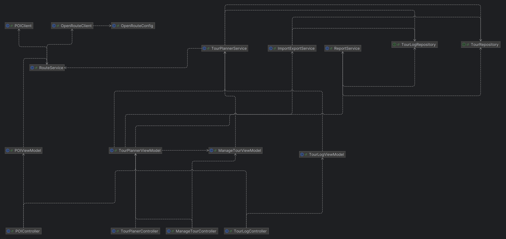

# TourPlanner (Latinovic, Asuncion)

TourPlanner ist eine JavaFX-Anwendung zur Verwalten von Touren.
Die Anwendung folgt dem MVVM-Architekturmuster und ermöglicht es Benutzer:innen, Touren zu erstellen,
zu bearbeiten, zu löschen und mit detaillierten TourLogs zu versehen.

## Requirements
```
* Version: 21
* JavaFX-web maybe has to be added manually 
    -IntelliJ Maven-Dependencies-(right click javafx-web)-Download sources

```

# Architecture
With the TourPlanner, we aimed to implement a JavaFX-based desktop application, enhanced by a Spring Boot backend that orchestrates the application’s overall logic and dependency management. This hybrid approach leverages the strengths of both frameworks: JavaFX for building a responsive GUI and Spring Boot for structuring backend services, managing configurations, and ensuring dependency injection.

We placed a strong emphasis on adhering to SOLID principles throughout the development process, resulting in a modular and maintainable codebase. Furthermore, the application design follows the MVVM (Model-View-ViewModel) pattern, ensuring a clean separation between the UI (View), the data-binding and UI logic (ViewModel), and the business logic.

The project is structured using a clear and conventional package organization, typical for Spring Boot applications:

* config: Handles application configuration such as bean definitions, data source settings, or other Spring-related setup.

* integration: Deals with external APIs or services (e.g., routing, mapping, or file exports).

* persistence: Manages data access logic, repositories, and database entities.

* service: Contains business logic and core service classes that are used by the ViewModels.

* view: Includes the JavaFX UI components controller classes.

* viewmodel: Implements the MVVM bridge between the views and the service layer, providing bindings and observable properties.



# Design pattern
## Observer Pattern
* StringProperty, ObjectProperty, ObservableList implement the observer pattern.
* UI components listen for changes and auto-update.

In our TourPlannerViewModel
```java
searchQuery.addListener((obs, oldVal, newVal) -> filterTours());
```
In our TourLogViewModel
```java
ObservableList<TourLog> allTourLogs = FXCollections.observableArrayList();
```

## Singleton
With the help of the SpringAnnotations like @Service, it is ensured
that only one instance exists across the app lifecycle.
```java
@Component
public class TourPlannerViewModel {
```


# Use-cases

# UX Documentation

This section describes the User Experience (UX) of the TourPlanner application.
It provides an overview of the UI elements and illustrates how users can interact with the application.

## Wireframe UI elements


| Label               | Description                                              |
| ------------------- |----------------------------------------------------------|
| **A FILE**          | Menu button to create a new tour or exit the application |
| **B EDIT**          | – *(currently unused)*                                   |
| **C OPTIONS**       | – *(currently unused)*                                   |
| **D HELP**          | – *(currently unused)*                                   |
| **E SEARCH**        | Text field to search for any a tour                      |
| **F List of Tours** | Displays all saved tours                                 |

#### G GENERAL Tab where the details of a selected Tour will be shown  
| Element            | Description                                                                                                                                                                                                                                      |
|--------------------|--------------------------------------------------------------------------------------------------------------------------------------------------------------------------------------------------------------------------------------------------|
| **H WebView**      | Displays a map (Leaflet) of the selected tour                                                                                                                                                                                                    |
| **I Tour Details** | Displays information about the selected tour:<br>– Tour Name<br>– Description<br>– From: Starting point<br>– To: Destination<br>– Transport: Type (Car, Train, None)<br>– Distance in kilometers<br>– Estimated duration based on transport type |

#### J MANAGE TOUR Tab where the details of saved Tours can be edited or saved  
| Element              | Description                                                       |
| -------------------- |-------------------------------------------------------------------|
| **K Tour Details**   | Input fields for editing tour data such as name, description, etc. |
| **L Transport Type** | Dropdown menu to select the mode of transport (CAR, NONE, TRAIN)  |
| **M ADD TOUR**       | Button to save the changes                                        |
| **N CANCEL**         | Button to cancel editing                                          |
| **O DELETE TOUR**    | Button to delete the selected tour                    |

#### P TOUR LOGS	Tab where all the logs of a selected Tour are to be found. Multiple logs can be saved for one tour.  
| Element            | Description                                                            |
|--------------------| ---------------------------------------------------------------------- |
| **Q ADD LOG**      | Button to save a newly entered tour log                                |
| **R SAVE CHANGES** | Button to save edits to a selected tour log                            |
| **S TableView**    | Displays all logs associated with the selected tour in a column format |
| **T Log Details**  | Input fields to add or update a specific tour log                      |
 

## User/Interactive Flow Wireframe  


# Library decisions
In this section the library used in this project are explained
## Text (PDF Generation
**iText (PDF Generation)**
We chose iText because it provides a powerful and flexible API for generating and manipulating PDF documents programmatically.

Why did we use this:
* Fine-grained control over layout and styling.
* Reliable and well-documented.
* Supports advanced features like tables, images, fonts, and metadata.

## @Slf4j (Logging with Lombok)
We use @Slf4j, a Lombok annotation, to automatically inject a Logger instance (log) into our classes using Simple Logging Facade for Java (SLF4J). This standardizes logging and makes it easy to output debug, info, or error messages without manual logger setup.

Why did we use this:

* Avoids manual logger instantiation (e.g., LoggerFactory.getLogger(...)).
* Encourages consistent logging practices across the project.
* Simplifies debugging and traceability of runtime behavior.
* Works seamlessly with logging frameworks like Logback or Log4j.

## Log4j 2 (Logging Implementation)
While @Slf4j provides a generic logging interface, we chose Log4j 2 as the actual logging implementation behind the scenes. Log4j 2 is a powerful, high-performance logging framework that integrates easily with SLF4J.

Why did we use this:

* More performant and flexible than the default Spring Boot logger (Logback).
* Fully compatible with SLF4J and Lombok’s @Slf4j.
* Customizable via log4j2.xml for console, file, or rolling log outputs.


## Lombok (Code Simplification)
We integrated Lombok to reduce boilerplate code such as getters, setters, constructors, equals, hashCode, and toString methods. It enhances code readability and maintainability by automatically generating these common methods via annotations like @Getter, @Setter, @Data, and @AllArgsConstructor.

Why did we use this:
* Cleaner and more readable codebase.
* Fewer lines of repetitive code.

# Unit-Tests
We used JUnit 5 and Mockito to write unit tests that verify the core functionality of our application. The goal was to ensure correctness, stability, and maintainability of the business logic.

## TourPlannerServiceTest
* Tests core features like adding, updating, filtering, and deleting tours and logs.
* Validates input and exception handling.
* Ensures correct calculation of popularity and child-friendliness.
* Verifies interaction with the RouteService and repositories.

## RouteServiceTest
* Covers logic for calculating routes and loading POIs via mocked API responses.
* Verifies distance/time parsing from external JSON.
* Ensures the system handles invalid addresses gracefully.

## ImportExportServiceTest
* Tests import/export of tours and logs in JSON format.
* Ensures data is saved and restored correctly.
* Verifies ID resets and object associations.

## OpenRouteClientTest
* Integration test using real address data with OpenRoute API.
* Validates geolocation and routing accuracy.
* Confirms correct API interaction and parsing.

# Tracked time
The implementation of this project took us arround 60 hours.
Mostly the troubleshooting and research took up the most time.

# See the code on Github
https://github.com/alatinovic-fh/TourPlanner


